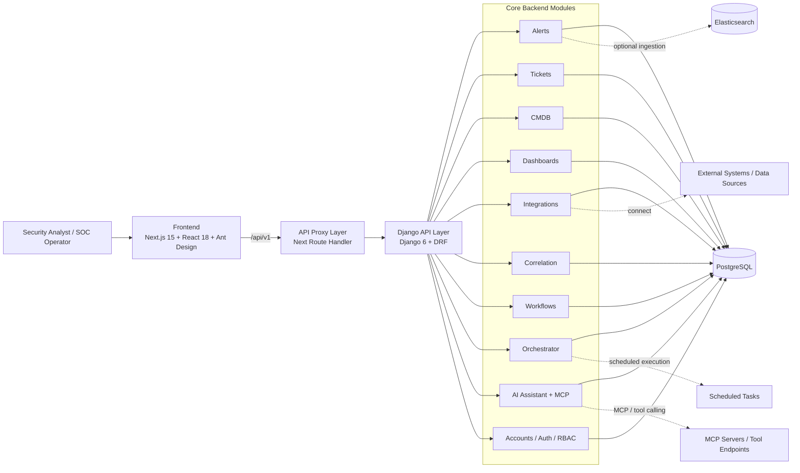

# Argus-Agentic-SOC-Platform

一个面向现代安全运营团队的 **AI Native Agentic SOC 开源平台**，将告警、工单、资产、编排与 AI 助手整合为统一工作台。

> 设计目标：**前后端分离、模块清晰、开箱即用、便于二次开发**

---


---
## 1. 项目亮点

| 特性 | 说明 |
| --- | --- |
| 前后端分离 | 前端采用 Next.js + React，后端采用 Django + DRF，职责边界清晰，便于并行开发与独立部署 |
| 模块化架构 | 告警、工单、CMDB、关联分析、工作流、编排器、AI 助手等模块分层组织，易理解、易扩展 |
| 便于二次开发 | 标准化 API 前缀、清晰目录结构、可插拔集成与 MCP 工具链，方便按场景快速定制 |
| 开箱即用 | 提供 Docker Compose 与 Kubernetes 部署清单，支持快速启动本地与生产环境 |

---

## 2. 核心能力

### 安全运营闭环
- 统一告警接入、检索与展示
- 工单全生命周期管理与协同
- CMDB 资产上下文关联
- 可视化运营看板
- 关联规则与调查辅助

### 自动化编排
- 工作流定义与 API 驱动执行
- 定时任务调度与审计追踪
- 告警/工单自动化处理链路

### AI 能力
- 内置 AI Assistant 对话式分析
- MCP 风格工具注册与 JSON-RPC 调用
- 面向工单、资产、可观测对象的上下文智能查询

### 平台基础能力
- Token 鉴权与 OTP 登录验证
- PostgreSQL 持久化（可选 Elasticsearch 扩展）
- 面向开发与部署的标准化工程配置

---

## 3. System Architecture Diagram



### Architecture Notes

1. Frontend: Built with Next.js App Router; handles pages, UI composition, and API proxying.
2. API Layer: Django + DRF provide unified business APIs (auth, alerts, tickets, CMDB, workflows, AI).
3. Business Layer: Domain features are organized into Django apps for independent evolution and RBAC.
4. Data Layer: PostgreSQL is the primary datastore; Elasticsearch is an optional alert source.
5. Intelligence Layer: AI Assistant offers conversation and tool-call capabilities, exposing MCP-style interfaces.
6. Automation Layer: Orchestrator and Workflows provide scheduled execution, orchestration, and audit trails.
More information:
https://github.com/Sec-Link/Argus-Agentic-SOC-Platform/blob/main/docs/architecture.md

---

## 4. Tech Stack

### Frontend
- Next.js 15
- React 18
- Ant Design 5

### Backend
- Django 6
- Django REST Framework
- DRF Token Authentication

### Data / Infrastructure
PostgreSQL 16 (optional)
Elasticsearch (optional)
---

## 5. Main Modules

| Module | Responsibility |
| --- | --- |
| `accounts` | Authentication, login, OTP, and permissions |
| `alerts` | Alert ingestion, caching, display, and search |
| `ai_assistant` | AI conversation, MCP tooling, and context routing |
| `cmdb` | Asset management and queries |
| `dashboards` | Visualization dashboards and views |
| `integrations` | External connectors and configuration |
| `correlation` | Correlation rules and investigative helpers |
| `workflows` | Workflow definitions and execution API |
| `workflow_interfaces` | Workflow interface adapter layer |
| `orchestrator` | Scheduled tasks, execution, and records |
| `tickets` | Incident/ticket management and related workflows |

---

## 6. Repository Layout

```text
Argus-Agentic-SOC-Platform/
├── backend/                  # Django backend
│   ├── accounts/
│   ├── alerts/
│   ├── ai_assistant/
│   ├── cmdb/
│   ├── correlation/
│   ├── dashboards/
│   ├── integrations/
│   ├── orchestrator/
│   ├── tickets/
│   ├── workflow_interfaces/
│   ├── workflows/
│   └── siem_project/         # Django project settings / urls
├── frontend/                 # Next.js frontend
│   └── src/
│       ├── app/
│       ├── components/
│       ├── modules/
│       ├── services/
│       └── lib/
├── k8s/                      # Kubernetes manifests
├── docker-compose.dev.yml    # Dev compose
├── docker-compose.prod.yml   # Prod compose
├── env.example               # Env template
└── makefile                  # Helper targets
```

---

## 7. User Manual
https://sec-link.github.io/Argus-Agentic-SOC-Platform/zh/overview/

## 8. API and access

The backend uses `/api/v1/` as the API prefix. Main areas include:

- `/api/v1/auth/`: login, logout, register, OTP
- `/api/v1/alerts/`: alerts capabilities
- `/api/v1/tickets/`: ticketing capabilities
- `/api/v1/cmdb/`: asset management
- `/api/v1/workflows/`: workflow capabilities
- `/api/v1/integrations/`: integration config and tests
- `/api/v1/ai-assistant/`: AI assistant and tooling
- `/api/v1/mcp/`: MCP JSON-RPC and tool registry

The frontend proxies `/api/v1/*` requests via a Next.js route handler to the backend service, centralizing browser-side API access.
More information: 
https://github.com/Sec-Link/Argus-Agentic-SOC-Platform/blob/main/docs/api-overview.md

---

## 9. Deployment

### Docker Compose
- `docker-compose.dev.yml`: local development
- `docker-compose.prod.yml`: production container setup

### Kubernetes
The `k8s/` directory contains basic deployment manifests:

- `k8s/backend-deploy.yaml`
- `k8s/frontend-deploy.yaml`
- `k8s/postgres-deploy.yaml`

---

## 10. Security & Hardening

In production we recommend:

- Use a secure random `SECRET_KEY`
- Precisely set `ALLOWED_HOSTS` and `CSRF_TRUSTED_ORIGINS`
- Add backups and monitoring for DB, object storage, and logs
- Configure access boundaries, auditing, and least-privilege for AI/MCP features


---
